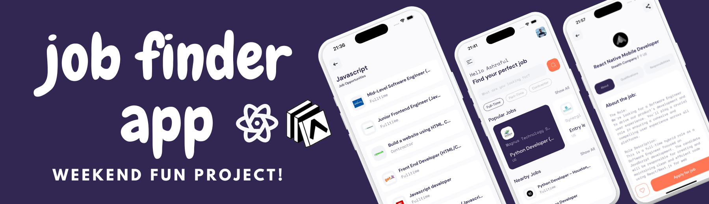

<div align="center">
  <br />
    <a href="https://github.com/islamashraful" target="_blank">
      
    </a>
  <br />
  <br />
  <h1 align="center">React Native Job Finder App</h1>

<div align="center">
A weekend fun project to develop a Job Portal app using  <a href="https://rapidapi.com/letscrape-6bRBa3QguO5/api/jsearch">RapidAPI(JSearch)</a> and React Native.<br/><br/>

</div>
Although it's a fun project, it's well structured and uses a clean and custom reusable hook for all the API calls with typescript. Checkout the Snippets section! 
</div>

## <a name="tech-stack">⚙️ Tech Stack</a>

- React Native (Expo 50)
- Typescript
- Axios
- Stylesheet

## <a name="quick-start">🤸 Quick Start</a>

Follow these steps to set up the project locally on your machine.

**Cloning the Repository**

```bash
git clone https://github.com/islamashraful/rn-jobs-app.git
cd rn-jobs-app
```

**Installation**

Install the project dependencies using npm:

```bash
yarn
```

**Set Up Environment Variables**

```env
EXPO_PUBLIC_API_KEY=YOUR_API_KEY
```

Replace `YOUR_API_KEY` with your actual credentials in `.env` file. You can obtain a key by signing up on the [RapidAPI website](https://rapidapi.com/letscrape-6bRBa3QguO5/api/jsearch).

**Running the Project**

```bash
yarn start
```

## <a name="snippets">🕸️ Snippets</a>

<details>
<summary><code>useApi.ts</code></summary>

```ts
import { useState } from "react";
import { AxiosRequestConfig, AxiosResponse, AxiosError } from "axios";

interface Response<T> {
  status: string;
  data: T;
}

export default function useApi<T>(
  func: (
    config?: AxiosRequestConfig<any>
  ) => Promise<AxiosResponse<Response<T>, any>>
) {
  const [data, setData] = useState<T | null>(null);
  const [error, setError] = useState("");
  const [loading, setLoading] = useState(false);

  const request = async () => {
    try {
      setLoading(true);
      const response = await func();
      setData(response.data.data);
    } catch (error: unknown) {
      console.log(error);
      if (error instanceof AxiosError) {
        setError(error.message || "Something went wrong");
      } else {
        // Handle other types of errors
        setError("An unexpected error occurred");
      }
    } finally {
      setLoading(false);
    }
  };

  return {
    data,
    error,
    loading,
    request,
  };
}

export default JobSearch;
```

</details>

<details>
<summary><code>Popularjobs.tsx</code></summary>

```tsx
import React, { useEffect, useState } from "react";
import {
  View,
  Text,
  Pressable,
  FlatList,
  ActivityIndicator,
} from "react-native";

import styles from "./popularjobs.style";
import { COLORS, SIZES } from "@/constants";
import PopularJobCard from "@/components/common/cards/popular/PopularJobCard";
import { useNavigation } from "@react-navigation/native";
import { StackScreenProps } from "@react-navigation/stack";
import { AppStackParamList } from "App";
import jobsApi from "@/api/jobs";
import useApi from "@/hook/useApi";
import { Job } from "@/models/jobs";

const Popularjobs = () => {
  const popularJobsApi = useApi<Job[]>(jobsApi.popular);
  const [selectedJob, setSelectedJob] = useState("");

  const { navigate } =
    useNavigation<StackScreenProps<AppStackParamList, "Home">["navigation"]>();

  useEffect(() => {
    popularJobsApi.request();
  }, []);

  return (
    <View style={styles.container}>
      <View style={styles.header}>
        <Text style={styles.headerTitle}>Popular Jobs</Text>
        <Pressable>
          <Text style={styles.headerBtn}>Show All</Text>
        </Pressable>
      </View>

      <View style={styles.cardsContainer}>
        {popularJobsApi.loading ? (
          <ActivityIndicator size="large" color={COLORS.primary} />
        ) : popularJobsApi.error ? (
          <Text>{popularJobsApi.error}</Text>
        ) : (
          <FlatList
            data={popularJobsApi.data}
            renderItem={({ item }) => (
              <PopularJobCard
                selectedJob={selectedJob}
                jobId={item.job_id}
                image={item.employer_logo}
                companyTitle={item.employer_name}
                position={item.job_title}
                country={item.job_country}
                onPress={() => {
                  navigate("JobDetails", { jobId: item.job_id });
                  setSelectedJob(item.job_id);
                }}
              />
            )}
            keyExtractor={(item) => item?.job_id}
            contentContainerStyle={{ columnGap: SIZES.medium }}
            horizontal
            showsHorizontalScrollIndicator={false}
          />
        )}
      </View>
    </View>
  );
};

export default Popularjobs;
```

</details>
